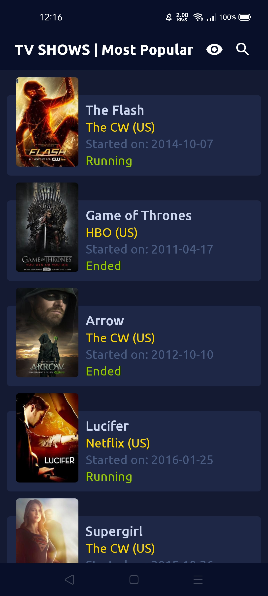
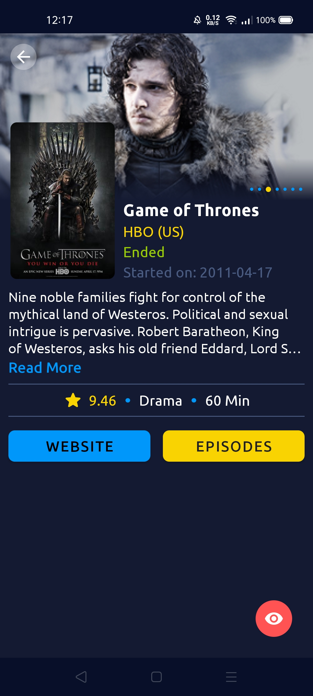
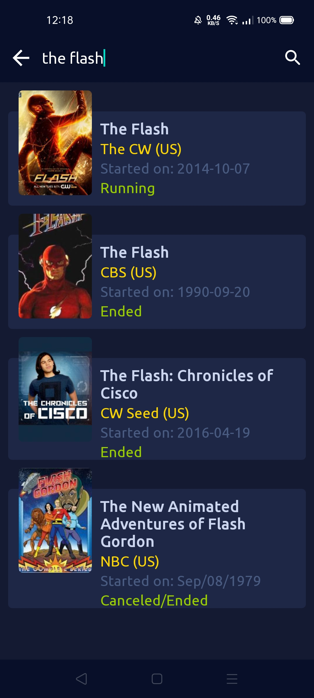
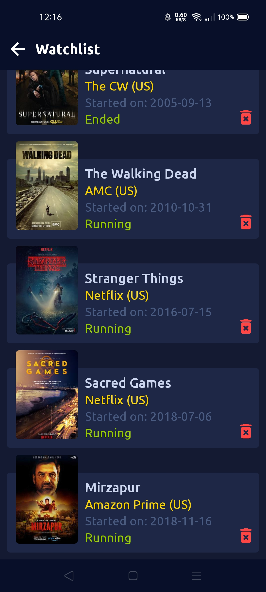

# DESCRIPTIONS

 App Name - **TV-SHOWS**
 
 Language Used - **JAVA**
 
 Architecture Used - **MVVM**
 
 
# FEATURES
 
 1. Displays TV shows
 
 2. Local cache
 
 3. Search API

 4. TV shows description
 
 5. Episodes List
 
# COMPONENTS

 1. MVVM Architeture
 
 2. Android Architecture Components
 
 3. Retrofit
 
 4. ROOM database
 
 5. RxJava
 
 6. Databinding
 
 7. Picasso Image Processing
 
# API USED

 [episodate API](https://www.episodate.com/api)
 
# SCREENSHOTS

 






# DEPENDENCIES
    
    ```
    // Material Design
    implementation 'com.google.android.material:material:1.2.1'

    // Retrofit and Gson
    implementation 'com.squareup.retrofit2:retrofit:2.9.0'
    implementation 'com.squareup.retrofit2:converter-gson:2.9.0'

    // Picasso
    implementation 'com.squareup.picasso:picasso:2.71828'

    // Lifecycle Extensions
    implementation 'androidx.lifecycle:lifecycle-extensions:2.2.0'

    // Room & RxJava Support
    implementation 'androidx.room:room-runtime:2.2.5'
    annotationProcessor 'androidx.room:room-compiler:2.2.5'
    implementation 'androidx.room:room-rxjava2:2.2.5'

    // RxJava
    implementation 'io.reactivex.rxjava2:rxandroid:2.0.1'

    // Scalable Size Units
    implementation 'com.intuit.sdp:sdp-android:1.0.6'
    implementation 'com.intuit.ssp:ssp-android:1.0.6'

    // Rounded ImageView
    implementation 'com.makeramen:roundedimageview:2.3.0'
    
    ```


